# Pronic ERP Demo Paneli

Bu proje, Pronic Yazılım'daki staj süresince geliştirilmiş, Python (Flask), SQLite ve Matplotlib kullanan bir web tabanlı ERP (Kurumsal Kaynak Planlama) konsept demo panelidir.

## Proje Hikayesi ve Amacı

Bu prototip, Pronic Yazılım'ın, potansiyel veya mevcut müşterilerine sunduğu Logo ERP çözümlerinin gücünü ve faydalarını sergilemek amacıyla geliştirdiği bir araçtır.

Panel, Logo ERP sistemlerinin temelindeki ilişkisel veritabanı yapısını ve iş akışlarını simüle eder. Farklı sektörlerden (Mobilya, Metal, Enerji, Yazılım vb.) örnek veriler içerir. Pronic, bu interaktif paneli, ERP sistemlerinin sağladığı veri yönetimi, stok takibi, satış kaydı ve kârlılık analizi gibi yetenekleri müşterilerine canlı olarak demo etmek veya pazarlamak için kullanabilir.

## Temel Fonksiyonler ve Yetenekler

* **Güvenlik:** Sabit parola (`pronic123`) ile korunan basit "Giriş Portalı" (Flask Session).
* **Ana Sayfa (Dashboard):** Sistemin genel durumunu gösteren özet kutular (Aktif Müşteri, Toplam Ürün, Toplam Satış) ve `matplotlib` ile üretilen dinamik "Müşteri Bazlı Toplam Kâr" grafiği.
* **Ana Veri Yönetimi (CRUD + Update):**
    * **Müşteri:** Yeni Müşteri Ekleme, Müşteri Listeleme, Müşteriyi **Pasife Alma/Aktif Etme (`UPDATE`)**.
    * **Ürün:** Yeni Ürün Ekleme, Ürün Listeleme (Stok Raporu).
    * **Stok:** Basit Stok Girişi Yapma (Mevcut stoğu artırma).
* **Satış Yönetimi (Hareketler):**
    * **Yeni Satış:** 2 adımlı (Özet/Onay) satış ekleme formu.
    * **Kayıt:** Satış yapıldığında stokları otomatik güncelleme (`UPDATE`) ve satış geçmişine kaydetme (`INSERT`).
* **İş Mantığı (Logic):**
    * **Pasif müşterilere satış yapılmasını engelleme.**
    * Müşteri sektörü ile ürün türü arasında esnek uyumluluk kontrolü (bilinmeyen türlere izin verir).
* **Raporlama:**
    * **Müşteri Listesi:** Sektör ikonları ve Aktif/Pasif durum rozetleri ile.
    * **Kritik Stok Raporu:** Maliyet/Birim fiyat ve renkli durum rozetleri (Stok Mevcut, Kritik Stok, Stok Yok) ile.
    * **Müşteri Bazlı Kâr Raporu:** Hangi müşterinin ne kadar ciro ve (maliyet hesabı yapılarak) ne kadar net kâr getirdiğini gösteren, kâra göre sıralı bir analiz raporu
    * **Satış Hareketleri Geçmişi:** Tüm satışları detaylı listeleyen döküm (Ödeme Durumu rozetleri ile).

## Kullanılan Teknolojiler

* **Backend:** Python 3, Flask (Web sunucusu, rotalama, session yönetimi)
* **Veritabanı:** SQLite 3 (İlişkisel veri tabanı)
* **Görselleştirme:** Matplotlib (Sunucu tarafında dinamik grafik üretme)
* **Frontend:** HTML5, CSS3 (Jinja2 Şablonlama ile)
* **İkonlar:** Font Awesome (CDN)

## Kurulum ve Kullanım

1.  Gerekli kütüphaneleri yükleyin:
    ```bash
    pip install flask matplotlib
    ```
2.  Veritabanını ve başlangıç verilerini oluşturmak için `kurulum.py`'yi çalıştırın:
    ```bash
    python kurulum.py
    ```
3.  Web sunucusunu başlatın:
    ```bash
    python web_uygulama.py
    ```
4.  Tarayıcınızda `http://localhost:5000` adresine gidin.
5.  Giriş parolasını kullanın: `pronic123`

---

## Proje Görüntüleri: Ana Sayfalar ve Raporlar

Uygulamanın ana arayüzü ve raporlama yetenekleri.

| Giriş Portalı | Ana Sayfa (Dashboard) |
| :---: | :---: |
| 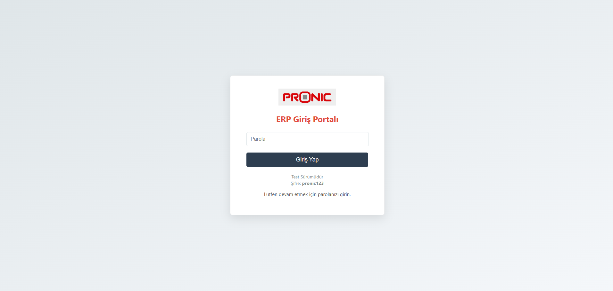 | 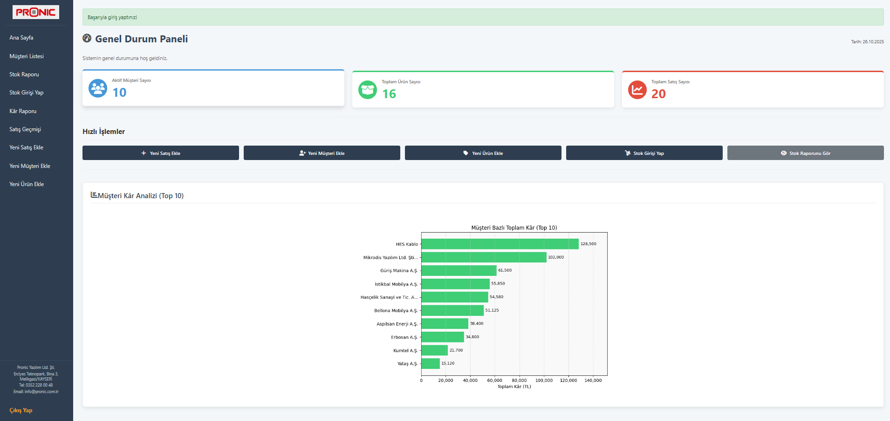 |

| Müşteri Listesi (Aktif/Pasif Özelliğiyle) | Kritik Stok Raporu |
| :---: | :---: |
| 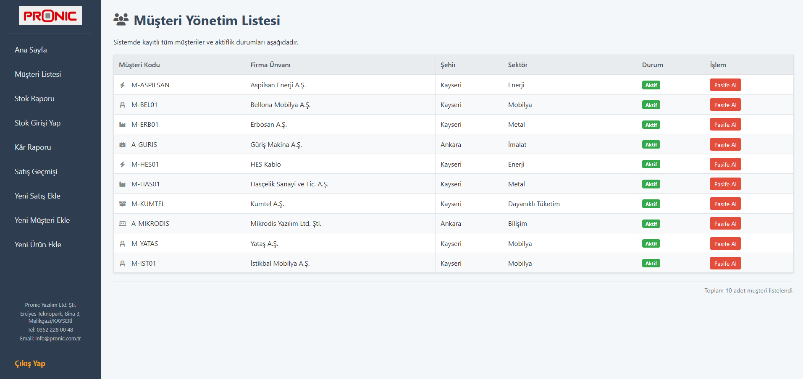 | 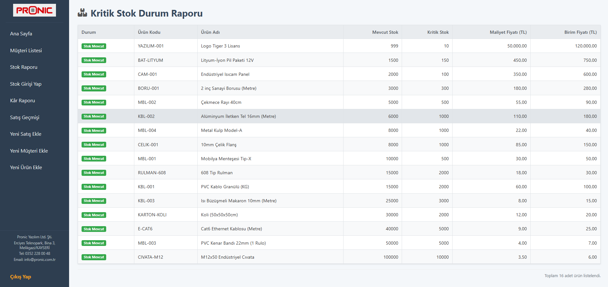 |

| Kâr Raporu | Satış Hareketleri Geçmişi |
| :---: | :---: |
| 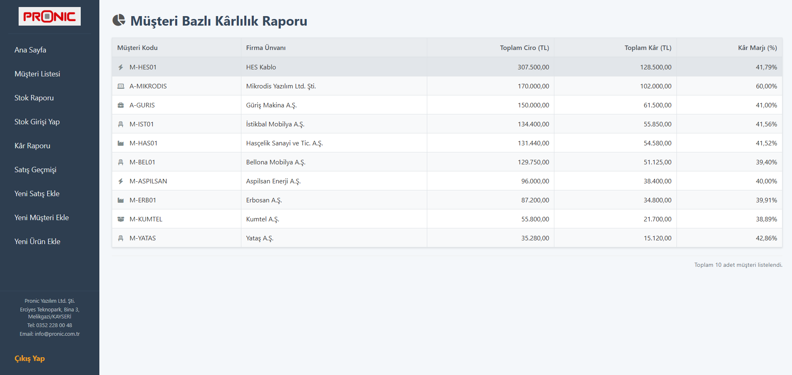 | 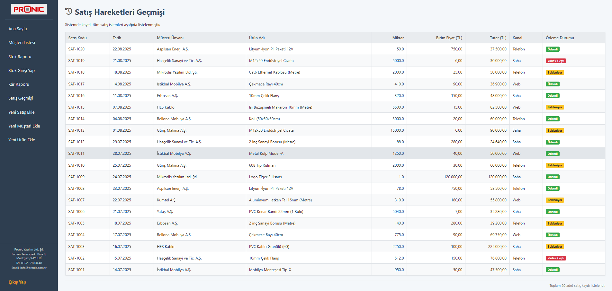 |

## Proje Görüntüleri: Veri Giriş Formları

Veri ekleme ve yönetme arayüzleri.

| Yeni Satış Ekleme | Stok Girişi Yapma |
| :---: | :---: |
| 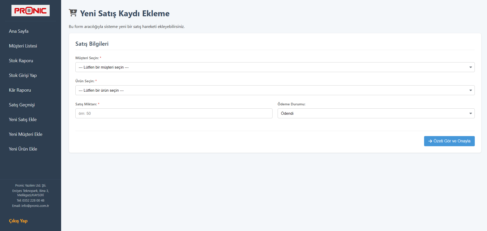 | 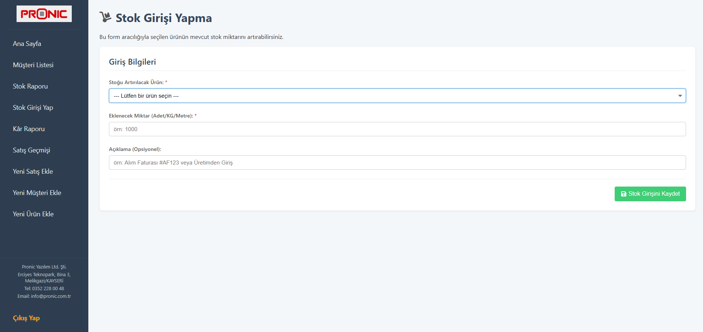 |

| Yeni Müşteri Ekleme | Yeni Ürün Ekleme |
| :---: | :---: |
| 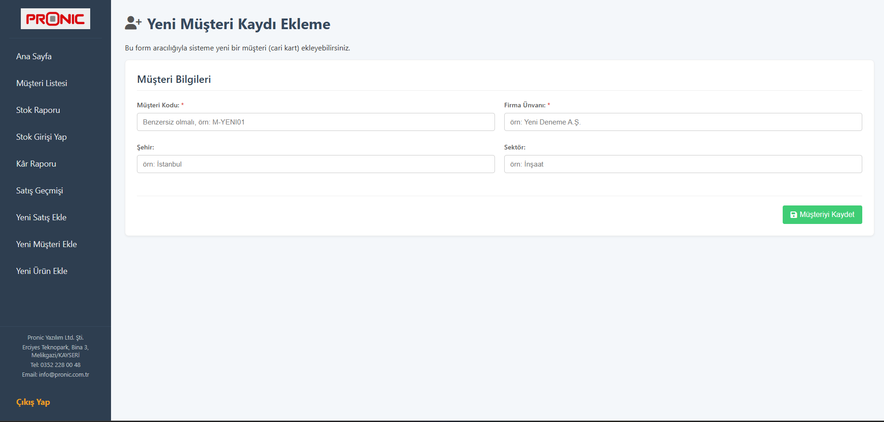 | 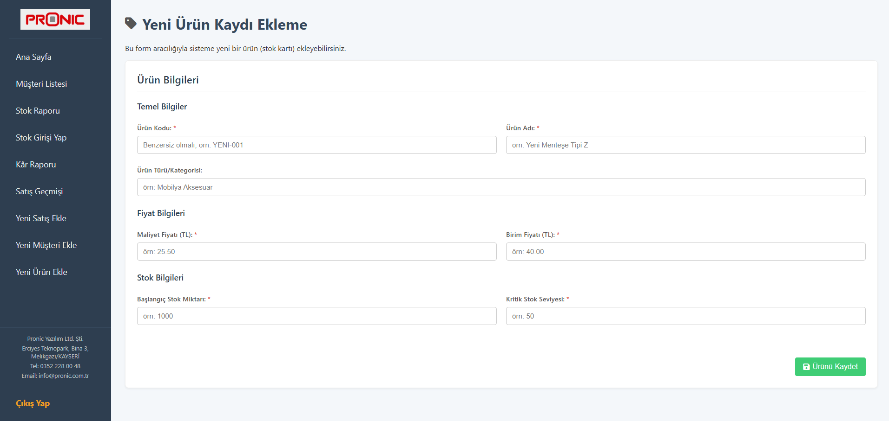 |

---

## Dinamik İş Akışı Örneği 1: Yeni Satış ve Grafik Güncellemesi

Bu akış, sisteme yeni bir satış eklendiğinde Kâr Grafiğinin nasıl dinamik olarak güncellendiğini gösterir.

**1. Satıştan ÖNCEKİ Dashboard:**
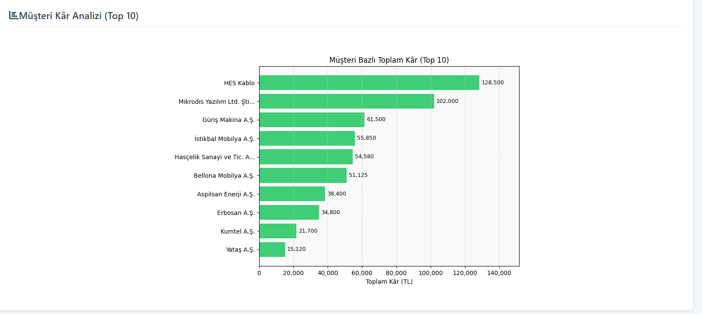
*(Açıklama: Grafik, mevcut satış verilerini gösteriyor.)*

**2. Satış İşlemi:**
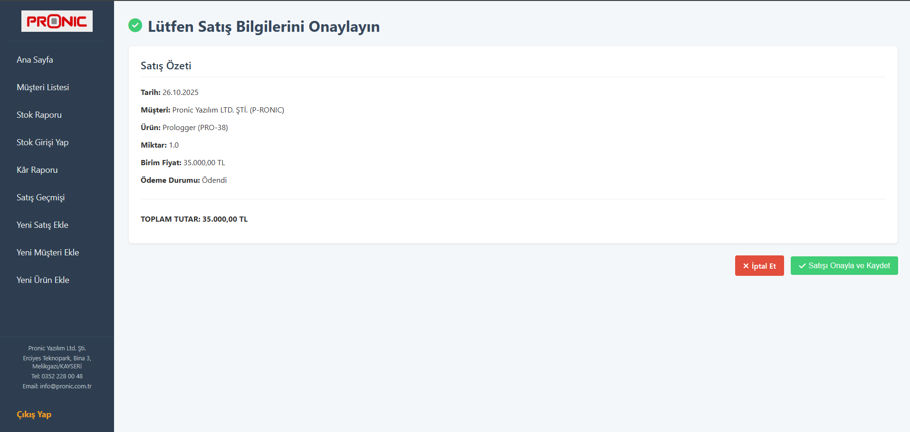
*(Açıklama: Yeni eklenen 'Pronic Yazılım' müşterisine 'Prologger' ürünü satışı yapılıyor ve onay ekranı görülüyor.)*

**3. Satıştan SONRAKİ Dashboard:**
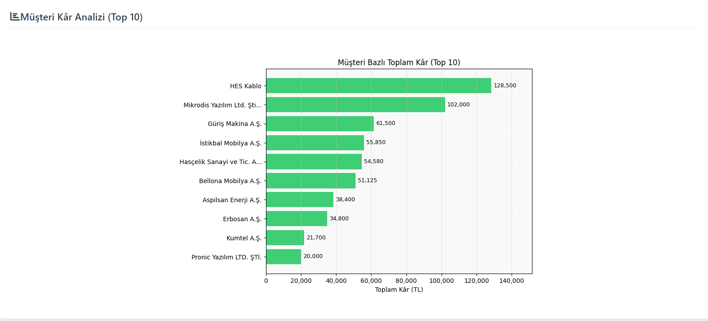
*(Açıklama: Ana sayfaya dönüldüğünde, grafiğin dinamik olarak güncellendiği ve Pronic Yazılım'ın kârının grafiğe eklendiği görülüyor.)*

---

## Dinamik İş Akışı Örneği 2: Müşteri Pasife Alma

Bu akış, bir müşterinin durumunun `UPDATE` komutuyla nasıl yönetildiğini ve iş mantığının (pasif müşteriye satış engeli) nasıl çalıştığını gösterir.

**1. Adım: Müşteri Aktif Durumda**
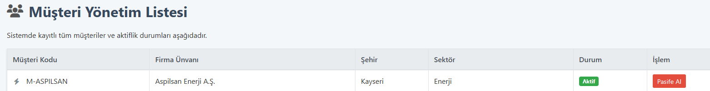
*(Açıklama: Müşteri listesinde 'Aspilsan' firması 'Aktif' durumdadır ve 'Pasife Al' butonu görünmektedir.)*

**2. Adım: Müşteri Pasife Alınıyor**
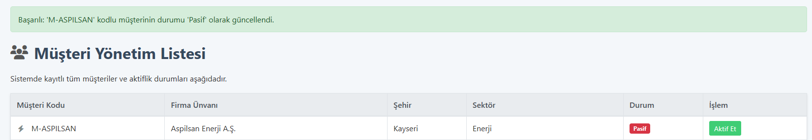
*(Açıklama: Butona basıldıktan sonra sayfa yenilenir. 'Aspilsan' firmasının durumu 'Pasif' olarak güncellenir ve buton 'Aktif Et' olarak değişir.)*

**3. Adım (Kanıt): Pasif Müşteriye Satış Engeli**
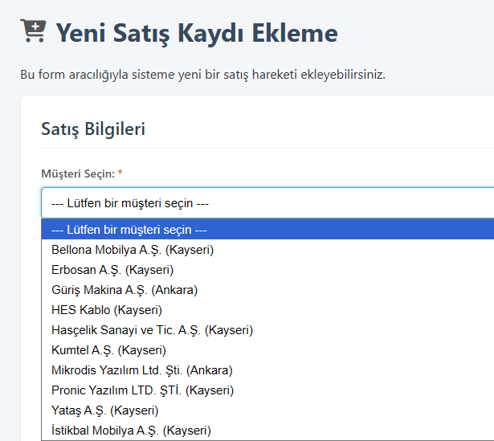
*(Açıklama: 'Yeni Satış Ekle' sayfasına gidildiğinde, 'Müşteri Seçin' dropdown listesinde 'Aspilsan' firması artık görünmez, böylece pasif müşteriye satış yapılması engellenir.)*