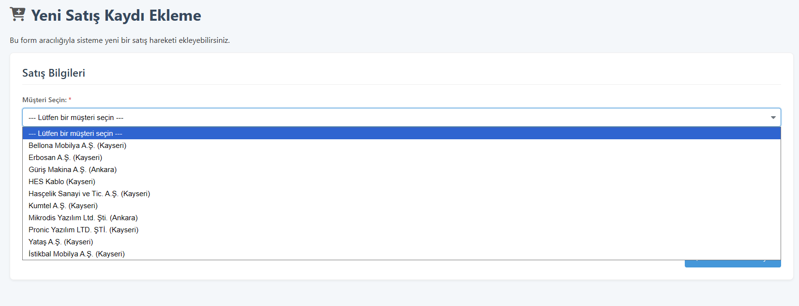

> ## 游 Projeyi Canl캼 캻nceleyin!
>
> **[https://aydinalpburkay.pythonanywhere.com/](https://aydinalpburkay.pythonanywhere.com/)**
>
> (Giri Parolas캼: `pronic123`)

---
# Pronic ERP Demo Paneli
Bu proje, Pronic Yaz캼l캼m'daki staj s칲resince geli릆irilmi, Python (Flask), SQLite ve Matplotlib kullanan bir web tabanl캼 ERP (Kurumsal Kaynak Planlama) konsept demo panelidir.

## Proje Hikayesi ve Amac캼

Bu prototip, Pronic Yaz캼l캼m'캼n, potansiyel veya mevcut m칲릆erilerine sundu릇 Logo ERP 칞칬z칲mlerinin g칲c칲n칲 ve faydalar캼n캼 sergilemek amac캼yla geli릆irdi를 bir ara칞t캼r.

Panel, Logo ERP sistemlerinin temelindeki ili륾isel veritaban캼 yap캼s캼n캼 ve i ak캼륿ar캼n캼 sim칲le eder. Farkl캼 sekt칬rlerden (Mobilya, Metal, Enerji, Yaz캼l캼m vb.) 칬rnek veriler i칞erir. Pronic, bu interaktif paneli, ERP sistemlerinin sa륿ad캼캼 veri y칬netimi, stok takibi, sat캼 kayd캼 ve k칙rl캼l캼k analizi gibi yetenekleri m칲릆erilerine canl캼 olarak demo etmek veya pazarlamak i칞in kullanabilir.

## Temel Fonksiyonler ve Yetenekler

* **G칲venlik:** Sabit parola (`pronic123`) ile korunan basit "Giri Portal캼" (Flask Session).
* **Ana Sayfa (Dashboard):** Sistemin genel durumunu g칬steren 칬zet kutular (Aktif M칲릆eri, Toplam 칖r칲n, Toplam Sat캼) ve `matplotlib` ile 칲retilen dinamik "M칲릆eri Bazl캼 Toplam K칙r" grafi를.
* **Ana Veri Y칬netimi (CRUD + Update):**
    * **M칲릆eri:** Yeni M칲릆eri Ekleme, M칲릆eri Listeleme, M칲릆eriyi **Pasife Alma/Aktif Etme (`UPDATE`)**.
    * **칖r칲n:** Yeni 칖r칲n Ekleme, 칖r칲n Listeleme (Stok Raporu).
    * **Stok:** Basit Stok Giri를 Yapma (Mevcut sto릇 art캼rma).
* **Sat캼 Y칬netimi (Hareketler):**
    * **Yeni Sat캼:** 2 ad캼ml캼 (칐zet/Onay) sat캼 ekleme formu.
    * **Kay캼t:** Sat캼 yap캼ld캼캼nda stoklar캼 otomatik g칲ncelleme (`UPDATE`) ve sat캼 ge칞mi를ne kaydetme (`INSERT`).
* **캻 Mant캼캼 (Logic):**
    * **Pasif m칲릆erilere sat캼 yap캼lmas캼n캼 engelleme.**
    * M칲릆eri sekt칬r칲 ile 칲r칲n t칲r칲 aras캼nda esnek uyumluluk kontrol칲 (bilinmeyen t칲rlere izin verir).
* **Raporlama:**
    * **M칲릆eri Listesi:** Sekt칬r ikonlar캼 ve Aktif/Pasif durum rozetleri ile.
    * **Kritik Stok Raporu:** Maliyet/Birim fiyat ve renkli durum rozetleri (Stok Mevcut, Kritik Stok, Stok Yok) ile.
    * **M칲릆eri Bazl캼 K칙r Raporu:** Hangi m칲릆erinin ne kadar ciro ve (maliyet hesab캼 yap캼larak) ne kadar net k칙r getirdi를ni g칬steren, k칙ra g칬re s캼ral캼 bir analiz raporu
    * **Sat캼 Hareketleri Ge칞mi를:** T칲m sat캼륿ar캼 detayl캼 listeleyen d칬k칲m (칐deme Durumu rozetleri ile).

## Kullan캼lan Teknolojiler

* **Backend:** Python 3, Flask (Web sunucusu, rotalama, session y칬netimi)
* **Veritaban캼:** SQLite 3 (캻li륾isel veri taban캼)
* **G칬rselle릆irme:** Matplotlib (Sunucu taraf캼nda dinamik grafik 칲retme)
* **Frontend:** HTML5, CSS3 (Jinja2 료blonlama ile)
* **캻konlar:** Font Awesome (CDN)

## Kurulum ve Kullan캼m

1.  Gerekli k칲t칲phaneleri y칲kleyin:
    ```bash
    pip install flask matplotlib
    ```
2.  Veritaban캼n캼 ve ba륿ang캼칞 verilerini olu릆urmak i칞in `kurulum.py`'yi 칞al캼릆캼r캼n:
    ```bash
    python kurulum.py
    ```
3.  Web sunucusunu ba륿at캼n:
    ```bash
    python web_uygulama.py
    ```
4.  Taray캼c캼n캼zda `http://localhost:5000` adresine gidin.
5.  Giri parolas캼n캼 kullan캼n: `pronic123`

---

## Proje G칬r칲nt칲leri: Ana Sayfalar ve Raporlar

Uygulaman캼n ana aray칲z칲 ve raporlama yetenekleri.

| Giri Portal캼 | Ana Sayfa (Dashboard) |
| :---: | :---: |
|  |  |

| M칲릆eri Listesi (Aktif/Pasif 칐zelli를yle) | Kritik Stok Raporu |
| :---: | :---: |
|  |  |

| K칙r Raporu | Sat캼 Hareketleri Ge칞mi를 |
| :---: | :---: |
|  |  |

## Proje G칬r칲nt칲leri: Veri Giri Formlar캼

Veri ekleme ve y칬netme aray칲zleri.

| Yeni Sat캼 Ekleme | Stok Giri를 Yapma |
| :---: | :---: |
|  |  |

| Yeni M칲릆eri Ekleme | Yeni 칖r칲n Ekleme |
| :---: | :---: |
|  |  |

---

## Dinamik 캻 Ak캼캼 칐rne를 1: Yeni Sat캼 ve Grafik G칲ncellemesi

Bu ak캼, sisteme yeni bir sat캼 eklendi를nde K칙r Grafi를nin nas캼l dinamik olarak g칲ncellendi를ni g칬sterir.

**1. Sat캼릆an 칐NCEK캻 Dashboard:**

*(A칞캼klama: Grafik, mevcut sat캼 verilerini g칬steriyor.)*

**2. Sat캼 캻륿emi:**

*(A칞캼klama: Yeni eklenen 'Pronic Yaz캼l캼m' m칲릆erisine 'Prologger' 칲r칲n칲 sat캼캼 yap캼l캼yor ve onay ekran캼 g칬r칲l칲yor.)*

**3. Sat캼릆an SONRAK캻 Dashboard:**

*(A칞캼klama: Ana sayfaya d칬n칲ld칲칲nde, grafi를n dinamik olarak g칲ncellendi를 ve Pronic Yaz캼l캼m'캼n k칙r캼n캼n grafi른 eklendi를 g칬r칲l칲yor.)*

---

## Dinamik 캻 Ak캼캼 칐rne를 2: M칲릆eri Pasife Alma

Bu ak캼, bir m칲릆erinin durumunun `UPDATE` komutuyla nas캼l y칬netildi를ni ve i mant캼캼n캼n (pasif m칲릆eriye sat캼 engeli) nas캼l 칞al캼릆캼캼n캼 g칬sterir.

**1. Ad캼m: M칲릆eri Aktif Durumda**

*(A칞캼klama: M칲릆eri listesinde 'Aspilsan' firmas캼 'Aktif' durumdad캼r ve 'Pasife Al' butonu g칬r칲nmektedir.)*

**2. Ad캼m: M칲릆eri Pasife Al캼n캼yor**

*(A칞캼klama: Butona bas캼ld캼ktan sonra sayfa yenilenir. 'Aspilsan' firmas캼n캼n durumu 'Pasif' olarak g칲ncellenir ve buton 'Aktif Et' olarak de를를r.)*

**3. Ad캼m (Kan캼t): Pasif M칲릆eriye Sat캼 Engeli**


*(A칞캼klama: 'Yeni Sat캼 Ekle' sayfas캼na gidildi를nde, 'M칲릆eri Se칞in' dropdown listesinde 'Aspilsan' firmas캼 art캼k g칬r칲nmez, b칬ylece pasif m칲릆eriye sat캼 yap캼lmas캼 engellenir.)*
